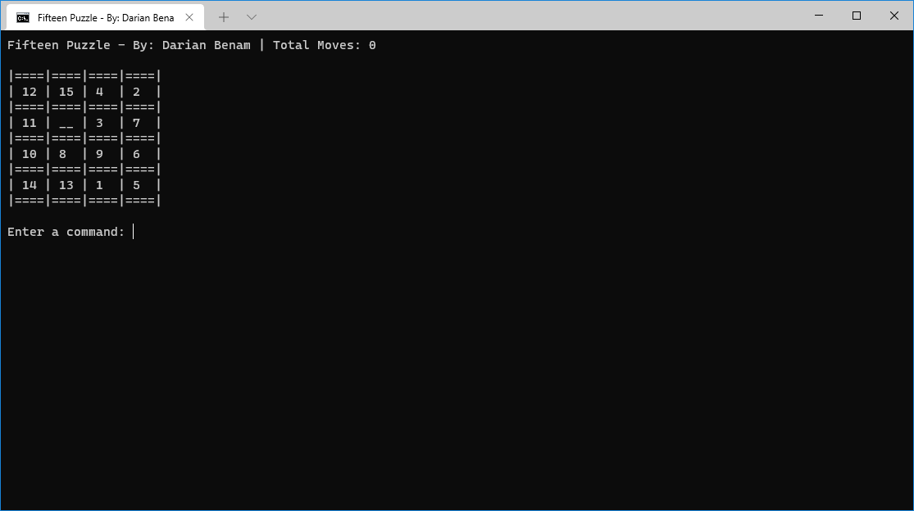
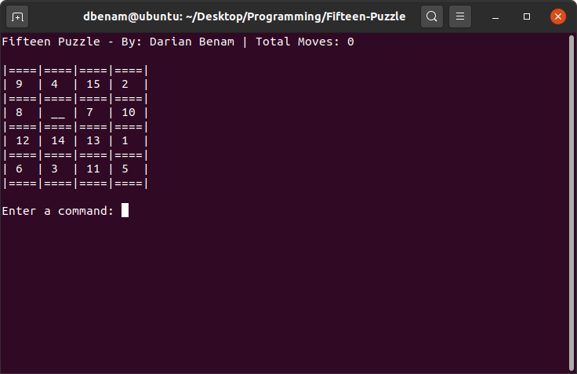

# Fifteen-Puzzle
Classic sliding puzzle game programmed in C++11. This program works on both Microsoft Windows and on Linux.

# Screenshots

# Video Showcase
Click [here](https://www.youtube.com/watch?v=5yzhFL_g3pY) to watch a YouTube video showing the Fifteen Puzzle project in action.
